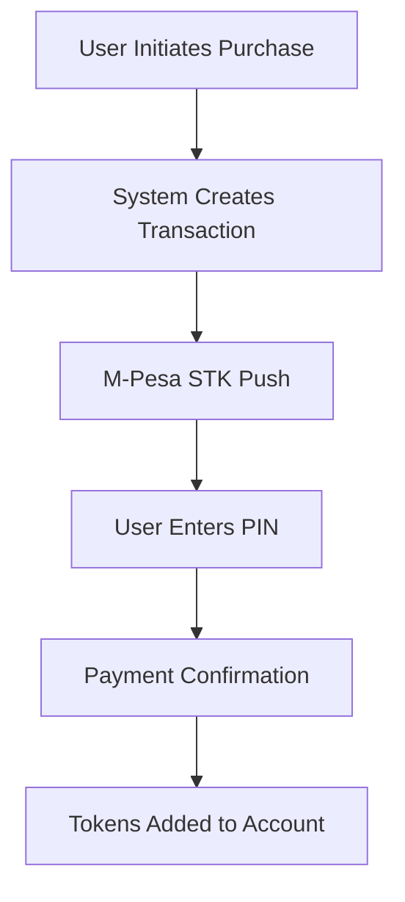
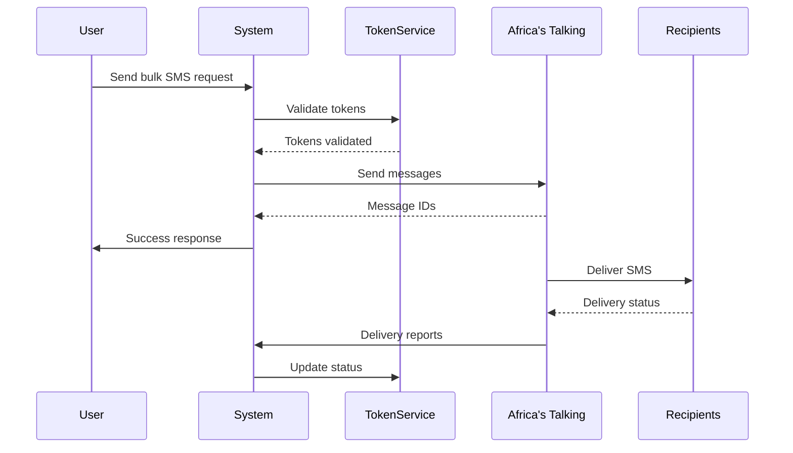

# Bulk SMS System Documentation

## Table of Contents
1. [System Overview](#system-overview)
2. [Subscription Plans](#subscription-plans)
3. [Token Management](#token-management)
4. [Payment Integration](#payment-integration)
5. [Africa's Talking Integration](#africas-talking-integration)
6. [Use Cases](#use-cases)
7. [Administrative Tools](#administrative-tools)
8. [API Reference](#api-reference)

## System Overview

The Bulk SMS System is a comprehensive solution for sending mass SMS messages with integrated token management, subscription handling, and payment processing. The system is designed for businesses, organizations, and enterprises requiring reliable bulk SMS capabilities.

### Key Features
- Token-based messaging system
- Flexible subscription plans
- M-Pesa payment integration
- Real-time delivery tracking
- Usage analytics and reporting
- Smart alerts and recommendations
- Administrative management tools

## Subscription Plans

### Available Plans

1. **Demo Plan**
   - Free trial tokens
   - Limited validity period
   - Basic features

2. **Starter Package**
   - Entry-level plan
   - Suitable for small businesses
   - Essential features

3. **Business Package**
   - Mid-tier plan
   - Advanced features
   - Priority support

4. **Enterprise Package**
   - High-volume messaging
   - All premium features
   - Dedicated support

### Plan Features
```json
{
    "demo": {
        "tokens": 100,
        "validity_days": 7,
        "features": ["basic_sending", "delivery_reports"]
    },
    "starter": {
        "tokens": 1000,
        "validity_days": 30,
        "features": ["basic_sending", "delivery_reports", "analytics"]
    },
    "business": {
        "tokens": 5000,
        "validity_days": 30,
        "features": ["all_starter_features", "api_access", "scheduled_sending"]
    },
    "enterprise": {
        "tokens": 20000,
        "validity_days": 30,
        "features": ["all_business_features", "priority_sending", "dedicated_support"]
    }
}
```

## Token Management

### Token System Overview
- 1 token = 1 SMS segment (160 characters)
- Messages longer than 160 characters use multiple tokens
- Tokens are deducted in real-time upon successful message sending
- Unused tokens remain valid throughout subscription period

### Token Operations

1. **Adding Tokens**
```python
TokenManagementService.add_tokens(
    user=user,
    tokens=1000,
    transaction_type='purchase',
    reference='TKN-12345678'
)
```

2. **Checking Balance**
```python
balance_info = TokenManagementService.get_token_balance(user)
```

3. **Token Transfer**
```python
TokenManagementService.transfer_tokens(
    from_user=sender,
    to_user=receiver,
    tokens=500,
    reason='Department transfer'
)
```

## Payment Integration

### M-Pesa Integration

1. **Initiating Payment**
```python
payment_response = TokenManagementService.purchase_tokens(
    user=user,
    package_type='business',
    payment_method='mpesa',
    phone_number='254712345678'
)
```

2. **Payment Flow**


### Payment Status Tracking
- Real-time payment status updates
- Automatic token allocation upon successful payment
- Failed payment handling and retries
- Transaction history and receipts

## Africa's Talking Integration

### Overview
The system integrates with Africa's Talking as the primary SMS gateway provider. This integration enables:
- High-volume SMS sending capabilities
- Real-time delivery reports
- Multiple sender IDs
- Geographic coverage across Africa
- Queue management for large campaigns

### Configuration

1. **API Credentials Setup**
```python
AFRICAS_TALKING_CONFIG = {
    'username': 'your_username',
    'api_key': 'your_api_key',
    'sender_id': 'your_sender_id',
    'environment': 'production'  # or 'sandbox' for testing
}
```

2. **Webhook Configuration**
```python
WEBHOOK_ENDPOINTS = {
    'delivery_reports': '/api/messages/delivery-callback/',
    'incoming_messages': '/api/messages/incoming/'
}
```

### Message Flow



### Implementation Steps

1. **Initialize Africa's Talking Client**
```python
from africastalking import AfricasTalking

at_client = AfricasTalking(
    username='your_username',
    api_key='your_api_key'
)
sms = at_client.SMS
```

2. **Send Messages**
```python
def send_bulk_sms(recipients, message, sender_id=None):
    try:
        # Send message
        response = sms.send(
            message=message,
            recipients=recipients,
            sender_id=sender_id
        )
        
        # Process response
        return {
            'message_id': response['SMSMessageData']['Recipients'][0]['messageId'],
            'status': 'sent',
            'recipients': len(recipients)
        }
    except Exception as e:
        return {
            'status': 'failed',
            'error': str(e)
        }
```

3. **Handle Delivery Reports**
```python
@api_view(['POST'])
def delivery_callback(request):
    """Handle delivery reports from Africa's Talking"""
    data = request.data
    
    # Map AT status to system status
    status_mapping = {
        'Delivered': 'delivered',
        'Failed': 'failed',
        'Rejected': 'failed',
        'Submitted': 'sent',
        'Buffered': 'pending'
    }
    
    # Update message status
    message_status = status_mapping.get(data['status'], 'unknown')
    
    # Process the callback
    try:
        update_message_status(
            message_id=data['id'],
            status=message_status,
            recipient=data['phoneNumber'],
            network_code=data.get('networkCode'),
            failure_reason=data.get('failureReason')
        )
        return Response({'status': 'success'})
    except Exception as e:
        return Response({
            'status': 'error',
            'message': str(e)
        }, status=400)
```

### Features and Capabilities

1. **Message Types Support**
- Text SMS (up to 160 characters)
- Unicode messages
- Concatenated messages (long messages)
- Bulk messaging
- Scheduled messaging

2. **Delivery Tracking**
- Real-time delivery status updates
- Network-level tracking
- Failure reason analysis
- Success rate monitoring

3. **Advanced Features**
- Message queuing
- Rate limiting
- Retry handling
- Error recovery
- Load balancing

### Best Practices

1. **Message Optimization**
```python
def optimize_message(message):
    # Remove unnecessary whitespace
    message = ' '.join(message.split())
    
    # Calculate segments
    segments = len(message) // 160 + (1 if len(message) % 160 > 0 else 0)
    
    return {
        'message': message,
        'segments': segments,
        'characters': len(message)
    }
```

2. **Batch Processing**
```python
def process_bulk_campaign(recipients, message, batch_size=1000):
    # Split recipients into batches
    batches = [
        recipients[i:i + batch_size] 
        for i in range(0, len(recipients), batch_size)
    ]
    
    results = []
    for batch in batches:
        # Send batch
        response = send_bulk_sms(batch, message)
        results.append(response)
        
        # Rate limiting
        time.sleep(1)  # Prevent API throttling
    
    return results
```

3. **Error Handling**
```python
def handle_sending_errors(response):
    if response.get('status') == 'failed':
        if 'insufficient credit' in response.get('error', '').lower():
            # Handle credit issues
            notify_admin('Low AT credit')
        elif 'invalid phone' in response.get('error', '').lower():
            # Handle invalid numbers
            log_invalid_numbers(response)
        else:
            # Handle other errors
            retry_failed_messages(response)
```

### Monitoring and Analytics

1. **Dashboard Metrics**
- Delivery success rate
- Message segments sent
- Credit usage
- Failed deliveries
- Network distribution

2. **Performance Monitoring**
```python
def monitor_at_performance():
    return {
        'delivery_rate': calculate_delivery_rate(),
        'average_latency': calculate_latency(),
        'credit_balance': get_at_credit_balance(),
        'failed_messages': get_failed_count(),
        'active_campaigns': get_active_campaigns()
    }
```

### API Reference Updates

1. **Send Message with AT**
```http
POST /api/messages/send/
{
    "recipients": ["254712345678"],
    "message": "Your message here",
    "sender_id": "COMPANY",
    "options": {
        "enqueue": true,
        "scheduled_time": "2024-01-01T10:00:00Z",
        "priority": "high"
    }
}
```

2. **Check AT Credit Balance**
```http
GET /api/integration/at/balance/
```

3. **Get Campaign Statistics**
```http
GET /api/campaigns/{campaign_id}/stats/
```

## Use Cases

### Case Study 1: Marketing Campaign

#### Scenario
A retail company needs to send promotional messages to 10,000 customers.

#### Implementation Steps

1. **Account Setup**
```python
# Create subscription
subscription = TokenManagementService.create_demo_subscription(user)
```

2. **Token Purchase**
```python
# Calculate required tokens
message_length = 300  # characters
recipients = 10000
segments = (message_length // 160) + (1 if message_length % 160 > 0 else 0)
required_tokens = segments * recipients

# Purchase tokens
payment = TokenManagementService.purchase_tokens(
    user=company_user,
    package_type='enterprise',
    payment_method='mpesa',
    phone_number='254712345678'
)
```

3. **Campaign Validation**
```python
# Validate tokens
TokenManagementService.validate_tokens_for_message(
    user=company_user,
    message_length=message_length,
    recipients_count=recipients
)
```

4. **Message Sending**
```python
# Send messages
TokenManagementService.deduct_tokens(
    user=company_user,
    tokens_used=required_tokens,
    message_id='CAMPAIGN-001'
)
```

5. **Campaign Monitoring**
```python
# Get usage statistics
stats = TokenManagementService.get_token_usage_stats(company_user)

# Get insights
insights = TokenManagementService.get_subscription_insights(company_user)
```

### Case Study 2: Automated Notifications

#### Scenario
A school system sending daily attendance notifications to parents.

#### Implementation Steps

1. **Setup Recurring Campaign**
```python
# Calculate daily token requirement
students = 1000
message_length = 100  # characters
daily_tokens = students * 1  # 1 segment per message

# Setup subscription
subscription = TokenManagementService.purchase_tokens(
    user=school_user,
    package_type='business',
    payment_method='mpesa',
    phone_number='254712345678'
)
```

2. **Daily Processing**
```python
# Validate daily tokens
TokenManagementService.validate_tokens_for_message(
    user=school_user,
    message_length=message_length,
    recipients_count=students
)

# Send daily messages
TokenManagementService.deduct_tokens(
    user=school_user,
    tokens_used=daily_tokens,
    message_id='ATTENDANCE-{date}'
)
```

3. **Monitoring and Alerts**
```python
# Setup low balance alerts
alerts = TokenManagementService.get_token_alerts(school_user)

# Monitor usage efficiency
insights = TokenManagementService.get_subscription_insights(school_user)
```

## Administrative Tools

### Management Commands

1. **Add Tokens**
```bash
python manage.py manage_tokens add --user company@example.com --tokens 1000
```

2. **Check Balance**
```bash
python manage.py manage_tokens check --user company@example.com
```

3. **Cleanup Old Transactions**
```bash
python manage.py manage_tokens cleanup --days 30
```

4. **Handle Subscription Expiry**
```bash
python manage.py manage_tokens expire
```

### Monitoring Tools

1. **Usage Statistics**
```python
stats = TokenManagementService.get_token_usage_stats(user, days=30)
```

2. **Subscription Insights**
```python
insights = TokenManagementService.get_subscription_insights(user)
```

## API Reference

### Token Management Endpoints

1. **Purchase Tokens**
```http
POST /api/tokens/purchase/
{
    "package_type": "business",
    "payment_method": "mpesa",
    "phone_number": "254712345678"
}
```

2. **Check Balance**
```http
GET /api/tokens/balance/
```

3. **Transfer Tokens**
```http
POST /api/tokens/transfer/
{
    "recipient_email": "user@example.com",
    "tokens": 500,
    "reason": "Department transfer"
}
```

### Message Sending Endpoints

1. **Send Bulk SMS**
```http
POST /api/messages/send/
{
    "recipients": ["254712345678", "254723456789"],
    "message": "Your promotional message here",
    "sender_id": "COMPANY"
}
```

2. **Check Delivery Status**
```http
GET /api/messages/{message_id}/status/
```

### Webhook Endpoints

1. **M-Pesa Payment Callback**
```http
POST /api/payments/mpesa/callback/
```

2. **Delivery Reports**
```http
POST /api/messages/delivery-callback/
```

This documentation provides a comprehensive overview of the Bulk SMS System's features, capabilities, and implementation details. For specific technical questions or custom implementations, please contact the system administrators. 